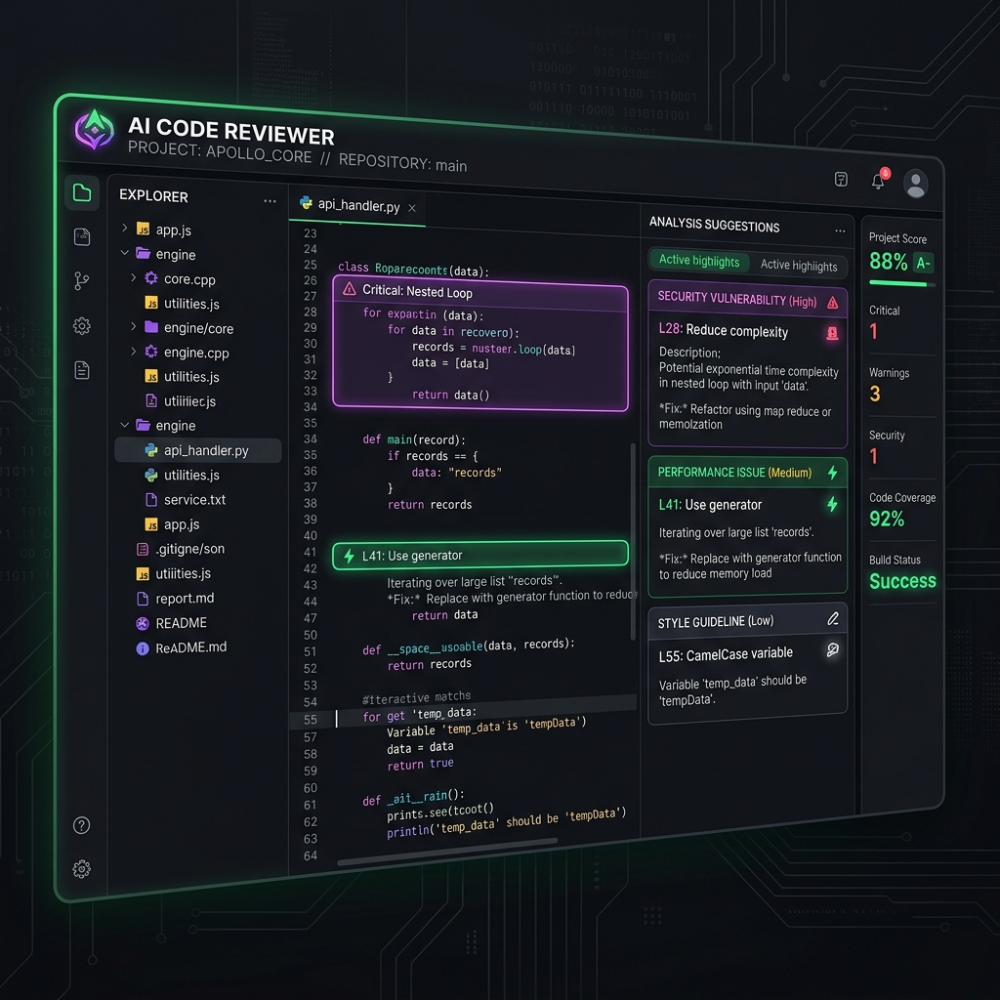
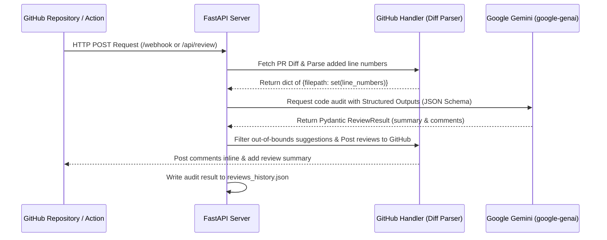

# AI Code Reviewer Bot

An automated code reviewer powered by Google Gemini, featuring a sleek, glassmorphic dashboard for simulation and review history.



## Features

- **GitHub PR Integration**: Reviews pull request diffs on GitHub Actions and posts inline feedback on security, performance, bugs, and style.
- **Diff Parser**: Analyzes PR diffs to extract exact line mappings and ensures comments are posted only on modified lines.
- **Review Simulator**: Paste any diff directly into the dashboard and see interactive reviews instantly.
- **History Viewer**: Keep track of previous pull request reviews.
- **Modern Glassmorphic Dashboard**: A premium, responsive UI built with pure CSS.

---

## Installation & Setup

### Prerequisites
- Python 3.10+
- A Google Gemini API Key

### Local Development

1. **Clone the repository**:
   ```bash
   git clone <repo-url>
   cd ai-code-reviewer-bot
   ```

2. **Install dependencies**:
   ```bash
   pip install -r requirements.txt
   ```

3. **Configure environment variables**:
   Create a `.env` file from the template:
   ```bash
   cp .env.example .env
   ```
   Add your `GEMINI_API_KEY`, `GITHUB_WEBHOOK_SECRET`, and optionally `GITHUB_PAT`.

4. **Run the server**:
   ```bash
   uvicorn backend.main:app --reload
   ```
   Open `http://localhost:8000` in your browser.

### Docker setup
Build and run with:
```bash
docker build -t ai-code-reviewer-bot .
docker run -p 8000:8000 --env-file .env ai-code-reviewer-bot
```

---

## System Architecture & Workflow

The system is built on top of FastAPI and leverages Google's Gemini models for structured AI analysis. The internal workflow behaves as follows:



1. **Triggering**: A PR trigger comes either as a webhook payload to `/webhook` (triggered automatically by GitHub webhook integrations) or as a structured request to `/api/review` (triggered from `.github/workflows/review.yml` inside CI).
2. **Diff Parsing**: The `GitHubHandler` fetches the raw git diff and runs the **Diff Parser** to isolate the exact line numbers in the *new version* of the files that were modified or added (lines starting with `+`).
3. **AI Code Audit**: A structured query (system prompt + git diff context + list of valid target lines) is compiled and dispatched to Google Gemini using the new `google-genai` SDK.
4. **Validation & Filtering**: The structured JSON response from Gemini is auto-validated into a Pydantic `ReviewResult` schema. The backend runs a validation pass to discard any AI suggestion that tries to comment on unmodified lines (which would cause GitHub comment creation to fail).
5. **Commenting**: Inline reviews are posted on GitHub at the precise line coordinates, and a high-level markdown summary is left on the PR.
6. **Dashboard History**: The review status, timestamps, and severity counts are stored locally in `reviews_history.json` (or an SQLite database if `SQLITE_DB_PATH` is configured) and rendered in the dashboard.

### Production Scaling (Task Queue & Database Worker)
To scale this application for large enterprise or highly active open-source repositories:
- **Async Task Broker**: Under high concurrent traffic, FastAPI's local `BackgroundTasks` can be migrated to a dedicated worker pool using **ARQ** or **Celery** to ensure heavy LLM calls do not block the web server's main event loop.
- **Relational Datastore**: The history store is abstracted to support SQLite by configuring `SQLITE_DB_PATH` in the environment. This handles database writes safely, preparing the app for containerized and serverless deployments (e.g. AWS Fargate, GCP Cloud Run) where local JSON file state would be ephemeral.

---

## API Documentation

### 1. Trigger PR Review
* **Endpoint**: `POST /api/review`
* **Description**: Triggers an asynchronous code review task for a GitHub Pull Request.
* **Payload**:
  ```json
  {
    "repo": "owner/repo-name",
    "pr_number": 42,
    "github_token": "ghp_your_github_token_here (optional, defaults to GITHUB_PAT env)"
  }
  ```
* **Response**: `{"message": "Review process initiated for owner/repo-name PR #42 in background."}`

### 2. Simulate Diff Review
* **Endpoint**: `POST /api/review-diff`
* **Description**: Reviews a raw git diff and returns structured AI suggestions. Used by the simulation dashboard.
* **Payload**:
  ```json
  {
    "diff_text": "diff --git a/src/main.py b/src/main.py..."
  }
  ```
* **Response**: Returns the Pydantic `ReviewResult` structure containing a markdown `summary` and a list of `comments` showing file paths, line numbers, comments, and severities (`info`/`warning`/`error`).

### 3. Get Review History
* **Endpoint**: `GET /api/history`
* **Description**: Retrieves history of recent reviews and simulations (up to last 50 entries).
* **Response**: A JSON array of logs.

### 4. GitHub Webhook Receiver
* **Endpoint**: `POST /webhook`
* **Description**: Receives GitHub Webhook events. Signature verification uses HMAC validation based on `GITHUB_WEBHOOK_SECRET`.
* **Headers**: Includes `X-Hub-Signature-256`.

---

## Running the Unit Tests

The project includes unit tests for checking the unified diff parsing logic under different code modification scenarios.

Run the test suite from the project root using:
```bash
python -m unittest test_diff_parser.py
```

---

## Contributing

We welcome contributions to the AI Code Reviewer Bot! 

1. Fork the repository.
2. Create a feature branch (`git checkout -b feature/amazing-feature`).
3. Commit your changes (`git commit -m 'Add some amazing feature'`).
4. Push to the branch (`git push origin feature/amazing-feature`).
5. Open a Pull Request.

Please make sure to write unit tests for any new parser or engine modifications inside `test_diff_parser.py`.

---

## License

This project is licensed under the MIT License. See the [LICENSE](LICENSE) file for details.

